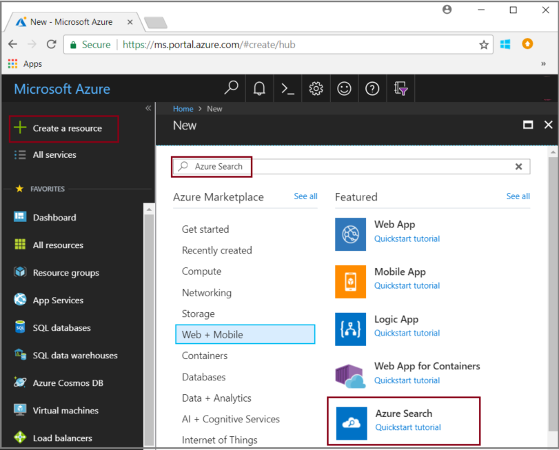

# Environment Creation

In this lab, you will create an Azure Search service and a storage account. We recommend keeping both in a new and unique resource group, to make it easier to delete at the end of the workshop (if you want to). We will also upload the data to a blob storage within the storage account.

## Step 1 - Clone the Repo

Cloning the repo will download all the training materials to your computer, including the dataset, the slides and the code for the Bot project. **The cloning of the repository will use close to 110 MB in total**.

### Task 1: Download GitHub resources

1.  Open a browser window to the GitHub repository (<https://github.com/Azure/LearnAI-KnowledgeMiningBootcamp>).

1.  Select **Clone or download**, then select **Download Zip**.

1.  Extract the zip file to your local machine, be sure to keep note of where you have extracted the files. You should now see a set of folders:

## Step 2 - Create the Azure Search service

1. Go to the [Azure portal](https://portal.azure.com) and sign in with your Azure account.

1.  Create a new resource group, click **Resources groups**, then click **Add**.  Select a subscription, type a name for the group, such as **INIT-kmb** and then select a region.  Click **Review + Create**, then click **Create**

1. In the resource group, click **Add**.  Search for **Azure Search**, then select **Azure Search**, then click **Create**. In addition to facilitating organization and visualization in the portal, using a single resource group helps you, if necessary at the end of the training, remove all services created. If you want to keep this solution up and running, for demos and POCs in minutes with your own data, this resources cleaning isn't necessary.

1. Click **Create a resource**, search for Azure Search, and click **Create**. See [Create an Azure Search service in the portal](https://docs.microsoft.com/en-us/azure/search/search-create-service-portal) if you are setting up a search service for the first time, and use the bullet point list below for the details you will use to fill out the details for the Azure Search service.

  

1. Ensure your newly created resource group is selected.  

1. For the **URL**, type your service name, choose a name that you can easily remember. We will use it many times in the labs. 

> **Note** The name of the service in the screenshots of this lab won't be available, you must create your own service name.

1. For **Location**, choose one of the regions below, Cognitive Search is not available in all Azure regions.

- West Central US
- South Central US
- East US
- East US 2
- West US 2
- Canada Central
- West Europe
- UK South
- North Europe
- Brazil South
- Southeast Asia
- Central India
- Australia East

1. For **Pricing tier**, select **Standard**.  For deeper information on Azure Search pricing and limits, click [here](https://azure.microsoft.com/pricing/details/search/) and [here](https://docs.microsoft.com/en-us/azure/search/search-limits-quotas-capacity).

1.  Click **Review + Create**, then click **Create**

1. Once the service is created, under **Settings**, click **Keys**

1.  Copy the **Primary admin key** to notepad or similar text editor for use later in the labs.

  

> **Note** Azure Search must have 2 replicas for read-only SLA and 3 replicas for read/write SLA. This is not addressed in this training. For more information, click [here](https://azure.microsoft.com/en-us/support/legal/sla/search/v1_0/)

## Step 3 - Create the Azure Blob service and upload the dataset

The enrichment pipeline pulls from Azure data sources. Source data must originate from a supported data source type of an [Azure Search indexer](https://docs.microsoft.com/en-us/azure/search/search-indexer-overview). For this exercise, we use blob storage to showcase multiple content types.

 1.  From the resource group, click **+Add**.  Search for **storage account**, select it, then click **Create**

 1. Ensure your newly created resource group is selected.  Type a unique name for your storage account, such as **INITkmbstorage**, 

 1.  Select the same location as your Azure Search resource.  This will help to avoid latency.

 1.  For performance, select **Standard**

 1.  For **account kind**, select **StorageV2**

 1.  For replication, select **Locally-redundant storage LRS**
 
 1.  Click **Review + create**, then click **Create**
 
 1. From the storage account **Overview** tab, click the link to **Blobs**.

 1.  Click the **+Container** link. For the name type `projections`:

1.  Select **Container** for Access Type.
 
1.  Click the **+Container** link. For the name type `basicdemo`:

1.  Select **Container** for Access Type.

1. Select the new container, then click **Upload**.  Browse to the **\resources\dataset** cloned github folder and select all the files, then click **Open**

1.  Click **Upload**, wait for all the files to upload.
 
 > **Note** You can also use the [Azure Storage Explorer](https://docs.microsoft.com/en-us/azure/storage/blobs/storage-quickstart-blobs-storage-explorer) to upload files. If you use the Storage Explorer, be careful not to create another folder level. This training is created with the assumption that all of the data is located in the root folder of the container.

1.  Ensure that 21 files were uploaded to the **basicdemo** container.

1.  Navigate back to the storage account blade, under **Settings**, click **Access keys**.

1.  Copy the **key1** **Connection string** by clicking the copy button.  Save the key to notepad or similar text editor.

## Step 4 - Create the Cognitive Services Account

A Cognitive Services resource is needed in order to enrich more than 20 documents per day in diromg Azure Search indexing. 

1.  From the resource group, click **+Add**.  Search for **cognitive services**, select it, then click **Create**

1.  For the name, type **INIT-cogs**

1.  For the location, select the same resource group as your search and storage account

1.  For the pricing tier, select **S0**

1.  Check the **I confirm I have read and understood the notice below** checkbox

1.  Click **Create**

## Next Step

[Azure Search Lab](../labs/lab-02-azure-search.md) or
[Back to Read Me](../README.md)