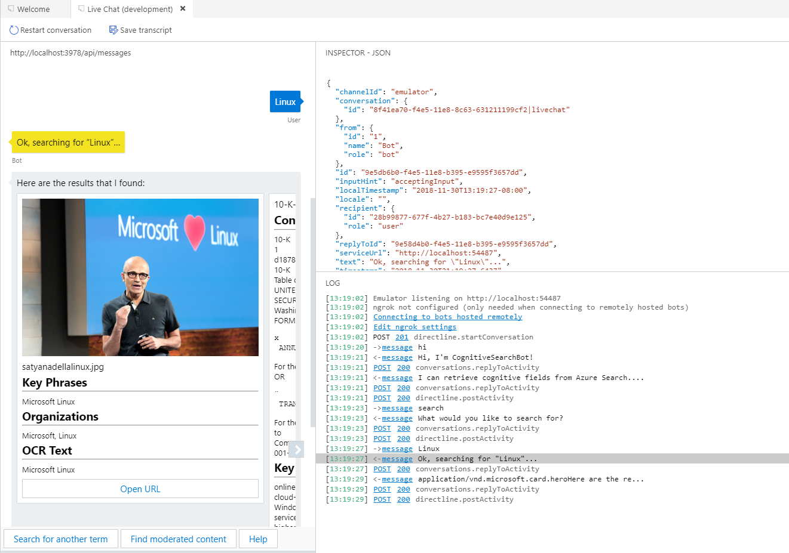
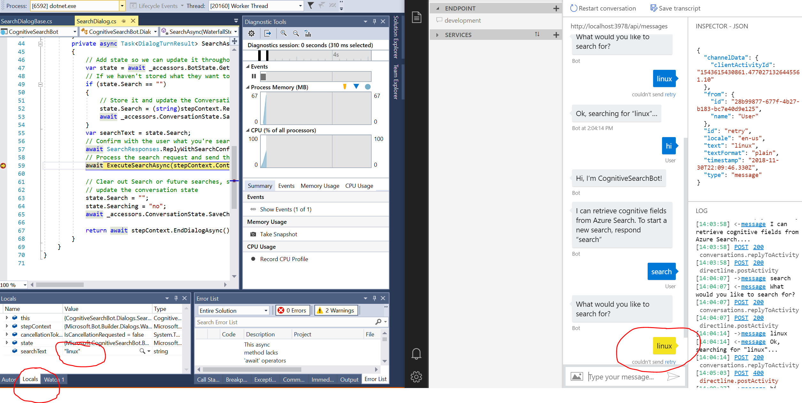

# Lab 4: Creating the Business Documents Bot

In this lab, you will learn how Azure Cognitive Search can be integrated into a bot using the Microsoft Bot Framework (SDK V4, .NET Core). Since this is not a bot course, the creation has been taken care of for you. However, you'll get the chance to interact with your search service via the bot and use debugging to follow the processes to call the Azure Cognitive Search API and format results. If you're interested in diving deeper into bot development, check out the [LearnAI: Azure Cognitive Services Bootcamp](https://azure.github.io/LearnAI-Bootcamp/emergingaidev_bootcamp) which integrates multiple Cognitive Services to create an intelligent agent.

> While this is a simple bot, this [gif](../resources/images/lab-bot/retrieving-cognitive-attrributes.gif) provides some inspiration for what a solution could look like in a real estate scenario. Hopefully, it gives you some inspiration for what's possible. You could also integrate this into a web app, here is a [WebMD example](http://webmedsearch.azurewebsites.net/) and a [Seismic data example](http://seismicsearch.azurewebsites.net/).

The image belows describes the bot created in this lab. Please notice that:

+ If you click on a chat message, the Bot Emulator will show you the JSON file of that interaction
+ The Log window shows you the status of the interactions
+ Preview of the files are loaded
+ URLs are returned, you can click an open the files
+ There is a menu to help your search experience, you will be able to find moderated documents with one click

## Bot Framework V4

This lab's bot uses framework V4, a complete re-write of the framework with new concepts, terminology, documentation, and architecture. BFv4 SDK is open source and available for JavaScript, C#, Python and Java.

The concept of the bot as a single code base which is published to multiple channels (Skype, Cortana, Facebook etc) remains the same. The Azure Bot Service idea also remains the same, an Azure web APP to host the bot server-side service. The code architecture key concepts are:

+ **Adapter:** It is the orchestrator for the bot, routing incoming and outgoing communication and authentication. For any interaction, it creates a `TurnContext` object and passes it to he bot application logic.

+ **Middleware:** the pipeline between the adapter and the bot code. It handles the bot state.

+ **Turn:** It is the action of the `TurnContext`been received by the bot. Normally there will be some processing and the bot will answer back to the user.

+ **Dialog and Conversations:** The way conversation flows through the bot has changed significantly compared to BFv3. Key docs include Manage conversation flow with dialogs and Create modular bot logic with a dialog container. These are some of the key concepts:

  + `Dialog`: simple turn interactions. Dialogs receive input from state or `OnTurn` function
  + `Prompt`: Dialog intent to capture and verify data from the bot user
  + `DialogContainer`: a collection of dialogs and prompts, executed in `WaterfallStep` sequency
  + `DialogSet`: Can contain Dialogs, prompts and dialog containers. Used for menus. Also kown as "root dialog"
  + `WaterfallStep`: the most granular action in the conversation.

+ **State:** Stores data relating to either the conversation or the user. State is a middleware component. Available storage layers are Memory (data is cleared each time the bot is restarted), Blob Storage and CosmosDB. **State management** automates the reading and writing of your bot's state to the underlying storage layer.

## Step 1 - Download and install the Bot Framework Emulator

The Bot Framework Emulator helps you run your bots locally for testing and debugging purposes. Download the emulator by going to [this page](https://github.com/Microsoft/BotFramework-Emulator/releases) and downloading the most recent version of the emulator that has the tag "Latest Release" (select the ".exe" file, if you are using windows). We suggest release 4.1.0 or newer. Be careful, the page is not sorted by release number.
> The instructions for the rest of the labs will assume you've downloaded the V4 Emulator (as opposed to the V3 Emulator).

The emulator installs to `c:\Users\`_your-username_`\AppData\Local\botframework\app-`_version_`\botframework-emulator.exe` or to your Downloads folder, depending on browser. Run the install and open the emulator, you'll use it shortly.

## Step 2 - Accessing the sample

As part of the environment creation lab, you should have cloned the repository to your local environment. If you have not, now is a good time to go back and do so.  

Under **resources > code-bot**, you should be able to locate a "Microsoft Visual Studio Solution File" called "CognitiveSearchBot.sln". Double-click on it to open the solution in Visual Studio.  

Once the solution is open, right-click on "Solution 'CognitiveSearchBot'" in the Solution Explorer (from now on we'll just refer to this as "the solution") and select "Rebuild" to pull down all the dependencies required.  

> Note: There is a lot of "stuff" in this solution. If you've worked with bots before, you may be interested in looking around to see how we've set up the state, regular expressions, and the dialogs/responses. If you've never worked with bots before, do not fret! This is not a bots course, so we'll walk you through the important things we want you to learn.  

Right-click on the solution and select "Manage NuGet Packages for Solution...". Under "Installed", you should find "Microsoft.Azure.Search" listed. There's no action here, but you should know that this package contains libraries that make it very easy for us to call the Azure Cognitive Search API and process the results.

Search for the BFV4 components mentioned above. Some of them are easy do find, the solution folders organize the code.

Open **SearchDialogBase.cs** by double-clicking on it in the Solution Explorer, it is in the Dialogs folder on the Solution Explorer. While there are lots of files in this solution, this is one of the most relevant. It does the integration with your search service. Spend at least five minutes reading the file **from start to finish**. We've commented what's happening on almost every line, so it is hopefully easy to follow, even if you don't have a background with bots. This code shows you how to interact with the Search service using C# and the Azure Search SDK.

Near the bottom of the Solution Explorer menu, you will see the Constants.cs file. Open it with a double click. You'll notice that you need to fill in your search service name, search service key, and index name. Since you've created and tested the index in Postman, you should have these readily available. If not, you can open the Azure portal and locate your Azure Search service to get the needed information. Fill in your information and save the file (you can use `CTRL` + `S`).

>Note! The Bot code has many references to the index fields. If you did not named the content moderator field as **moderatedText** or the OCR field as **myOcrText**, you will need to change the code to use your fields names. The files to be changed are: /Dialogs/ModeratedContentSearchDialog.cs and /Models/SearchHit.cs .

## Step 3 - Interacting with your Cognitive Search Bot

In Visual Studio, select the green button (looks like a play button) in the top menu bar to run the bot (you can alternatively select `F5` on your keyboard). This will build and run the bot locally, opening a few pages for testing purposes. The pages will close if you stop running the bot.  

Open the Bot Emulator if it is not open already. Select the button "Open Bot" from the Welcome page. Navigate to where your "BotConfiguration.bot" file is located (should be under **resources > code-bot** if you followed the previous instructions).  

This should open a chat window with your bot. You can start by saying some sort of greeting ("hi", "hello", "whats up bot", etc.). The bot should respond with a greeting, followed by the help message that says what it can do. Since really all it can do is search, enter "search" to trigger the search dialog. There is also a menu to avoid typing, it comes up right after the greeting. You can also ask for help, but the answer will be the same you had before.

You should now be able to submit search requests, and your results should be returned. Try searching for various items and inspecting your results. If you're unsure what to search for, here are a few suggestions: "satya nadella", "financial reporting", "security issues", "Azure", "cognitive services", "cloud", "sql server", "learnai", "reports". Try to search using both the menu button and typing search + enter + the term you want to search for.

## Step 4 (optional) - Using break points to understand the search flow

If you want to dive slightly deeper into calling the Azure Cognitive Search API and processing the results, we have provided some guidance on how to do so with break points.  

First, stop your bot (by hitting the stop button in Visual Studio).  

Open the **SearchDialog.cs** file. First, note that on line 3 there is a reference for CognitiveSearchBot, that is using the Azure Search SDK (file **SearchDialogBase.cs**). Remember, this is crucial to running the commands you are about to step through.  

Next, scroll down to where the search related tasks are located. Place a break point on line 59, where there is the command `await ExecuteSearchAsync(stepContext.Context, searchText);`, by clicking in the grey area left of the numbers. You should see a red dot next to the break point lines, as shown below:  

Next, run the bot (select `F5`) and on the Bot Emulator, search for something. Anything works. Visual Studio will likely start blinking requesting your return. In Visual Studio, you should see the line about to be executed highlighted. Select `F11` repeatedly to step through what is happening as the search is processed. In the bottom box within Visual Studio, you should see "Locals". These values can be expanded and inspected. For example, when you should be able to see the search you just did.

Using break points for debugging and seeing how calls are made and processed is a very valuable tool. If you'd like to learn more, [start here](https://docs.microsoft.com/en-us/visualstudio/debugger/getting-started-with-the-debugger?view=vs-2017).  

> Want to dive deeper into bot development? Check out the [LearnAI: Azure Cognitive Services Bootcamp](https://azure.github.io/LearnAI-Bootcamp/emergingaidev_bootcamp) which integrates multiple Cognitive Services to create an intelligent agent.

## Cleaning your environment

You have completed all of the hands-on portions of the course. We recommend deleting the resource group (and all of the resources in it) to avoid incurring extra charges.

## Next Step

[Final Case](../labs/lab-final-case.md) or
[Back to Read Me](../README.md)