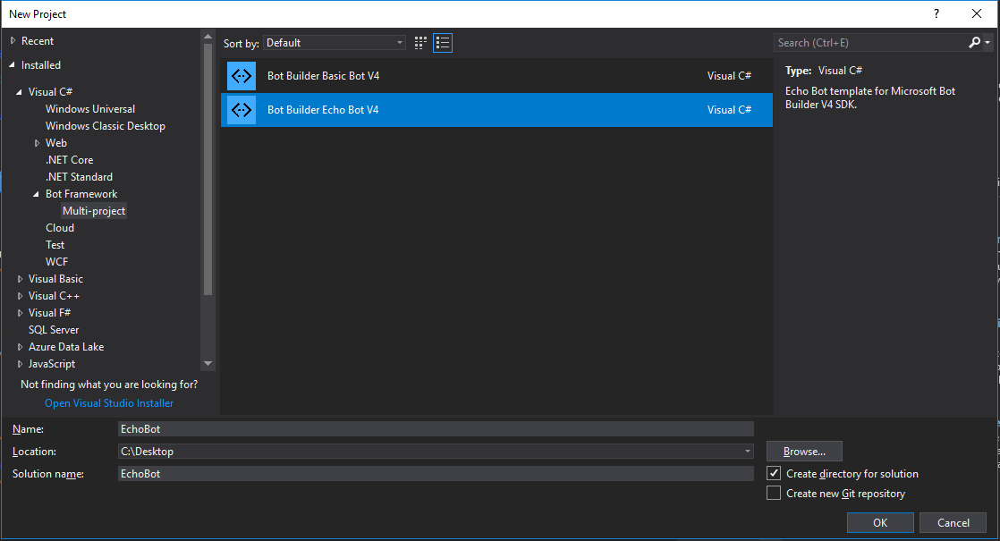
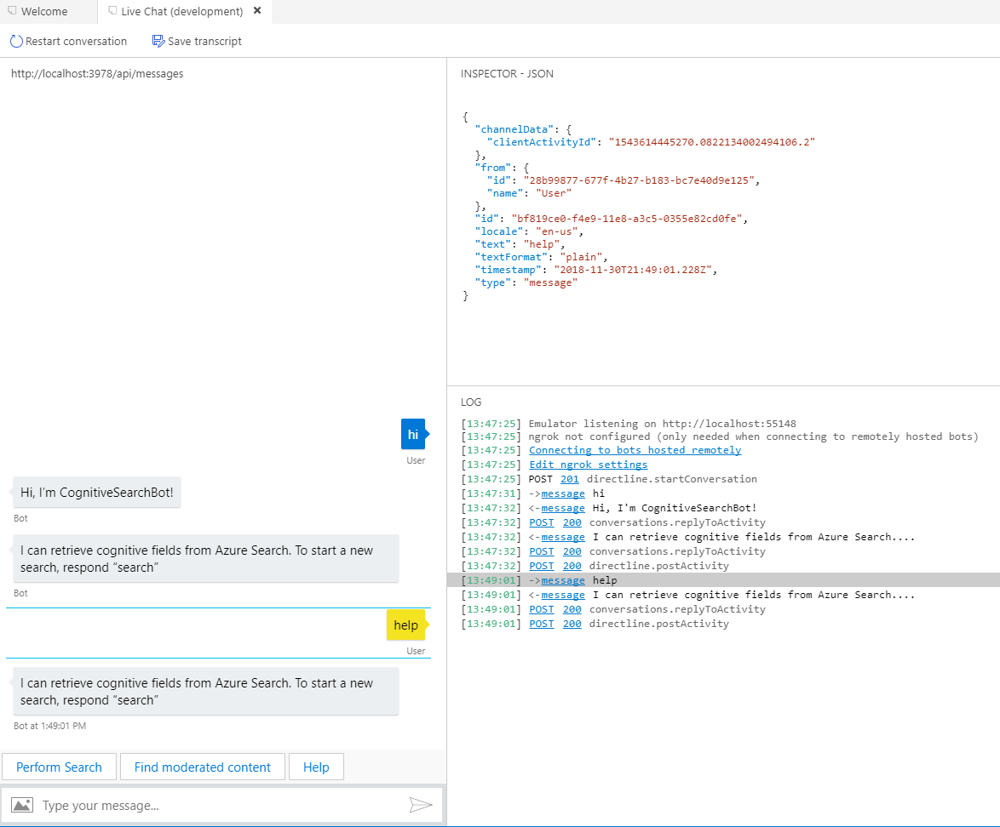

# Creating the Business Documents Bot

In this lab you will create a simple bot to learn how to interact with the Azure Cognitive Search API. If you want deeper knowledge on Bots Development, check the [Learn AI Vision Bootcamp](https://azure.github.io/LearnAI-Bootcamp/emergingaidev_bootcamp).

This [gif](./resources/images/sol-arch/retrieving-cognitive-attrributes.gif) has the expected finished solution, so now you have idea of what we will be created now.

## Step 1 - Download and install the Bot Framework Emulator

You can skip this step if you have did it already.

The Bot Framework Emulator helps you running your bots locally, for testing and debuging. The instructions for the rest of the labs will assume you've downloaded the v4 Emulator (as opposed to the v3 Emulator). Download the emulator by going to [this page](https://github.com/Microsoft/BotFramework-Emulator/releases) and downloading the most recent version of the emulator that has the tag "Latest Release" (select the ".exe" file, if you are using windows).  

The emulator installs to `c:\Users\`_your-username_`\AppData\Local\botframework\app-`_version_`\botframework-emulator.exe` or to your Downloads folder, depending on browser.

## Step 2 - Download and install the the Bot Framework

You can skip this step if you have did it already.

Download and install the Bot Framework from this [page](https://botbuilder.myget.org/feed/aitemplates/package/vsix/BotBuilderV4.fbe0fc50-a6f1-4500-82a2-189314b7bea2)

## Step 3 - Testing if everything is ok - Creating the Echo Bot

The echo bot is a simple template to verify if the previous installations are working as expected. Thanks to the template, your project contains all of the code that's necessary to create the bot in this quickstart. You won't actually need to write any additional code.

+ In Visual Studio, create a new bot project using the Bot Builder Echo Bot V4 template

+ If needed, change the project build type to .Net Core 2.1

+ If needed, [update NuGet packages](https://docs.microsoft.com/en-us/nuget/quickstart/install-and-use-a-package-in-visual-studio)

+ Click the run button, Visual Studio will build the application, deploy it to localhost, and launch the web browser to display the application's default.htm page. At this point, your bot is running locally

+ Start the emulator and connect your bot. Click the **Open Bot** link in the emulator "Welcome" tab

+ Select the .bot file located in the directory where you created the Visual Studio solution

+ Send a message to your bot, and the bot will respond back with a message

>Note!
If you see that the message can not be sent, you might need to install [ngrok](https://ngrok.com/) and restart your machine, as ngrok didn't get the needed privileges on your system yet.

## Step 4 - Build the Business Documents Bot

## Next Step

[Final Case Lab](../labs/lab-final-case.md) or
[Back to Read Me](../README.md)